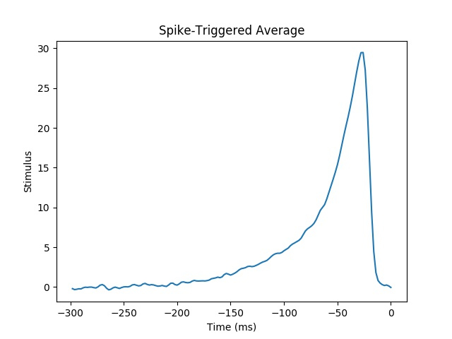

## 1. Set the variable named sampling_period in quiz2.m (quiz2.py) equal to this value.
The data set we have given you is comprised of a stimulus vector (named stim) and a binary vector (named rho). 
These two vectors are the same length because they represent measurements of two different quantities over the same time period. 
The binary vector has a 1 if a spike occurred in the time bin corresponding to the that index and a 0 otherwise. 
The sampling rate for the data set was 500 Hz.

How many milliseconds are there between adjacent samples (what is the sampling period)? Only enter the number, not the units. 
If your answer is not an integer, round to the nearest integer value. 
Set the variable named sampling_period in quiz2.m (quiz2.py) equal to this value.

```
2
```

## 2. Set the variable named num_timesteps in quiz2.m (quiz2.py) equal to this value and enter it below.
We wish to compute the spike-triggered average for this neuron over a window of width 300 ms. 
Suppose we do not care about the value exactly 300 ms before the spike. 
How many elements (time steps) will be in our resulting spike-triggered average vector? 
Set the variable named num_timesteps in quiz2.m (quiz2.py) equal to this value and enter it below.

Hint: Your answer should be an even number.

```
150
```

## 3.
In order to calculate the average, it is necessary for us to know how many time windows (stimulus vectors) we are averaging over. This is equal to the number of observed spikes. Write code to calculate the total number of spikes in the data set c1p8.mat. 
How many spikes were observed in this recording? 
You should not count any spikes that occur before 300 ms from the beginning of the recording.

Set the variable named num_spikes in compute_sta equal to this value, 
or (better yet) use the expression/variable/code you used to calculate this value and set it equal to num_spikes so that your code will work for any set of parameters (different sampling rate, different time window in which average is calculated etc.) passed to compute_sta.

```
53583
```

## 4.
Now we may compute the spike-triggered average. 
To do this, add code to compute_sta. 
Remember that the spike-triggered average is the element-wise mean of the time windows starting 300 ms before (exclusive) and ending 0 ms before a spike. 

Note that we have given you code to find all of the indices in the stimulus vector that correspond to the spike times (labeled as the variable spike_times in compute_sta).

Which of these plots most closely matches the spike-triggered average for this data set?



> what is spike-triggered average?
> The spike-triggered average (STA) is a tool for characterizing the response properties of a neuron using the spikes emitted in response to a time-varying stimulus. The STA provides an estimate of a neuron's linear receptive field. It is a useful technique for the analysis of electrophysiological data.

Mathematically, the STA is the average stimulus preceding a spike. To compute the STA, the stimulus in the time window preceding each spike is extracted, and the resulting (spike-triggered) stimuli are averaged (see diagram). The STA provides an unbiased estimate of a neuron's receptive field only if the stimulus distribution is spherically symmetric (e.g., Gaussian white noise).

The STA has been used to characterize retinal ganglion cells,neurons in the lateral geniculate nucleus and simple cells in the striate cortex (V1) . It can be used to estimate the linear stage of the linear-nonlinear-Poisson (LNP) cascade model. The approach has also been used to analyze how transcription factor dynamics control gene regulation within individual cells.

Spike-triggered averaging is also commonly referred to as “reverse correlation″ or “white-noise analysis”. The STA is well known as the first term in the Volterra kernel or Wiener kernel series expansion.[12] It is closely related to linear regression, and identical to it in common circumstances.
