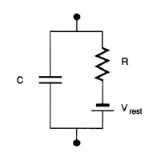
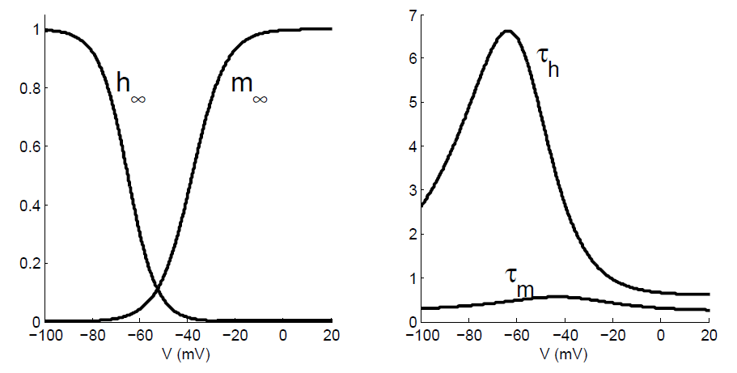
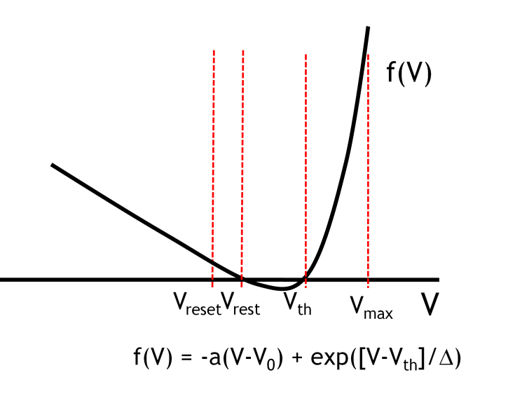
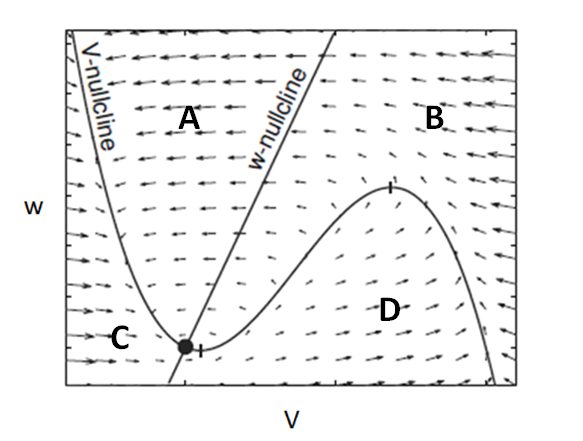

# Computing in Carbon

## 1. 

When we talk about "spikes", we are referring to the change in some property of the neuron over time. When we typically plot a spike, the x-axis represents time. What does the y-axis represent?

(i) Capacitance
(ii) Charge
(iii) Current
(iv) Conductance
(v) Voltage

Answer:

voltage

## 2. 

In this circuit diagram representing a piece of neuronal cell membrane, the battery, resistor, and capacitor are roughly analogous to the ___ , ___ , and ___ respectively.

(i) ion concentration gradient, lipid bilayer, ion channels
(ii) ion concentration gradient, ion channels, lipid bilayer
(iii) ion channels, lipid bilayer, ion concentration gradient
(iv) ion channels, ion concentration gradient, lipid bilayer
(v) lipid bilayer, ion channels, ion concentration gradient
(vi) lipid bilayer, ion concentration gradient, ion channels

Answer:

## 3. 

Let's imagine there is another ion that is relevant to determining a neuron's membrane potential in addition to those discussed in the lecture. We'll call the ion $\text{Im}^{+}$(for Imaginary). The equilibrium potential of $\text{Im}^{+}(E_{Im})$ is -100 mV. Assume the resting potential of the neuron is -65 mV. When specialized $\text{Im}^{+}$ channels open, the $\text{Im}^{+}$ conductance will increase. This will ___  the cell, thus  ___ its membrane potential.

(i) depolarize, increasing
(ii) depolarize, decreasing
(iii) hyperpolarize, increasing
(iv) hyperpolarize, decreasing

Answer:

## 4. 

Suppose $\text{Im}^{+}$ channels are composed of 5 subunits that open and close independently, as well as an additional "ball-in-socket" gating mechanism. Each of the 5 subunits has a voltage-dependent open probability uu and closed probability (1-u), while the ball-in-socket gating mechanism has a voltage-dependent open probability zz and closed probability (1-z). Which expression could most likely be used to express the $\text{Im}^{+}$ current across the membrane?

$I_{Im}$ = ${\bar{g}}_{Im}uz(V - E_{Im})$

$I_{Im}$ = ${\bar{g}}_{Im}u(1-z)(V - E_{Im})$

$I_{Im}$ = ${\bar{g}}_{Im}(1-u)^{5}(1-z)(V - E_{Im})$

$I_{Im}$ = ${\bar{g}}_{Im}u^{5}z(V - E_{Im})$

Answer:

## 5. 

Let's come back to the real-life $\text{Na}^{+}$ (sodium) channel, whose voltage-dependent dynamics are shown above. $m_{\infty}$ and $h_{\infty$ (the steady states of m and h) are shown for different V, along with the associated voltage-dependent time constants $\tau_{m}$ and $\tau_{h}$. Remember that mm is the probability that any individual channel subunit is open and hh is the probability that the additional ball-in-socket gating mechanism is open. If the neuron is at its resting potential (around -65 mV), and we deliver a current injection that decreases the membrane voltage to -75 mV, which of the following will be the first to reach its new steady state?

(i) Actually, the steady states will not change.
(ii) h
(iii) m
(iv) They will both reach their steady states simultaneously.

Answer:

## 6.

Refer again to the figure shown above the previous question. Remember that $\text{Na}^{+}$ current depolarizes the cell and is the principal driver for the upward portion of a spike. Both mm and hh must be high for there to be a lot of $\text{Na}^{+}$ current. $h_{\infty}$ becomes 0 when voltage is close to or greater than -30 mV. How, then, is it possible for the membrane to depolarize beyond V = -30 mV during a spike (spikes peak closer to V = 40 mV)?

K+ current also helps to depolarize the membrane, allowing the membrane voltage to reach higher values.
$m_{\infty}$ becomes very high at higher voltages, thus compensating for low values of h.
$\tau_{h}$ is high relative to $\tau_{m}$, so hh does not reach $h_{\infty}$ fast enough to block the spike.
$\tau_{h}$ decreases significantly from resting voltage to higher voltages.

Answer:

## 7. 

True or false: All neural coding can essentially be reduced to variations in firing rate. This allows the information in complex spiking patterns to be summarized in a "rate code."

Answer:

## 8. 

Recall the exponential integrate and fire neuron model, schematized above. How many stable fixed points does the system have?

(i) 0
(ii) 1
(iii) 2
(iv) 3

Answer:

## 9. 

The FitzHugh-Nagumo model is a 2-dimensional dynamical neuron model. It is defined by the following two differential equations:
$$
\begin{aligned}
  \dfrac{dV}{dt} &= V(a - V)(V - 1) - w + I \\
  \dfrac{dw}{dt} &= bV - cw 
\end{aligned}
$$

where V is voltage, ww represents an outward hyperpolarizing current, I is injected current, and a, b, and c are constants.

Which of the following is an expression for the w-nullcline?

$w = V(a-V)(V-1)+I$

$w = \dfrac{bV}{c}$

$\dfrac{dV}{dt} = V(a - V)(V - 1) - w + I$

$\dfrac{dw}{dt} = bV - cw$

Answer:

## 10. 

The above figure is a phase plane based on the FitzHugh-Nagumo model from the previous question. A vector field is shown that gives a sense of the flow of the system. If we observe a spike in this system, the trajectory will travel counterclockwise around the phase plane. The first part, or “upstroke,” of the spike occurs in which of the following regions of the phase plane (regions are labeled in the figure)?

A
B
C
D

Answer:

## 11. 

The next five questions utilize the following MATLAB code to model a passive neuronal membrane as an RC-circuit. (Remember that in the membrane model, the resistor and capacitor are in parallel.)
This code demonstrates how a membrane responds to a constant current input that is turned on for a fixed time interval and then turned off.

What if the current were not turned off? What would the **steady state voltage** of the membrane be?

Use the values given in the script to compute your answer (C = 0.1 nF, R = 100 M$\Omega$, I = 10 nA). You should give your answer in mV. Do not include units in your answer.

Answer:

## 12. 

Change the values for the membrane's resistance and capacitance (R and C), and find out how this influences the response of the membrane. Does it reach a stable value more quickly or more slowly after multiplying R by 5?

More slowly.
More quickly.
Same rate.

Answer:

## 13. 

Does it reach a stable value more quickly or more slowly after dividing C by 10?

More slowly.
More quickly.
Same rate.

Answer:

## 14. 

Does it reach a stable value more quickly or more slowly after multiplying R by 10 AND dividing C by 10?

More slowly.
More quickly.
Same rate.

Answer:

## 15. 

An experimental method for calculating a membrane’s time constant $\tau$ (when R and/or C are not known) is to start at zero and record the time at which the membrane potential VV reaches a value approximately equal to $0.6321V_{peak} = 0.6321IR$, where I is the constant injected current. Check if this method works by injecting different amounts of current I and changing the values for R and C. Once you’ve convinced yourself that the experimental $\tau$ appears to be identical to the theoretical $\tau(= RC)$ in all these cases, provide a theoretical justification for why this method works.

To do this, find the solution to the differential equation for the passive membrane:
$$
\begin{aligned}
  \dfrac{\text{d}V}{\text{d}t} &= - \dfrac{V}{RC} + \dfrac{I}{C} 
dt \\
  V(0) &= 0
\end{aligned}
$$
After solving the differential equation you should be able to use the fact that $V_{peak}$ = IR and $\frac{e - 1}{e} = .6321 
$ to complete the derivation and show that $V(\tau) = 0.6321IR$.

Which of these equations is the solution to the given differential equation?

$V(t) = IR(1 - e^{\frac{t}{\tau}})$
$V(t) = IR(1 - e^{-\frac{t}{\tau}})$
$V(t) = IRV(t)=IR$
$V(t) = IRe^{-\frac{t}{\tau}}$

Answer:

## 16. 

In the next three questions, you will explore the integrate-and-fire neuron model. To do this, you should start by downloading the following code and tweak it to run "experiments" on the neuron:

What is the largest current that will fail to cause the neuron to spike? Give your answer in pA and round down to the nearest 10 pA. Do not include units in your answer.

You should vary the input current gradually from very low to high values to find this value and then validate your answer with an analytical solution.

Answer:

## 17. 

Continued from Question 16:

What is the maximum firing rate (spike count/trial duration) of this neuron? Give your answer in Hz and round your answer to the nearest integer value. Do not include the units in your answer.

Answer:

## 18. 

Now let's consider the case that your neuron is not receiving simply a constant input, but a barrage of asynchronous inputs from many other neurons.

Model this with the following code by adding a white noise component to the input current (the constant part of the input current is reset to one nA):

Plot the interspike interval distribution, that is, the distribution of the time intervals between spikes, for a range of different noise amplitudes. (Hints: this noise component is already implemented in the code: just switch it on. You can make use of the Matlab functions diff and hist. You will probably want to increase tstop, the length of time you are integrating for, by quite a bit to get a well-sampled histogram.)

What best describes how this distribution changes as you increase the amplitude of the noise input? (Stay within a range between 0 and 5 nA.)

(i) The distribution of intervals broadens from a single sharp peak to an exponential-like distribution, but with an avoided range near zero.
(ii) The addition of noise does not affect the distribution of intervals.
(iii) The distribution of intervals becomes approximately Gaussian, with a width that increases with the amplitude of the noise.
(iv) The distribution of intervals widens from a narrow peak to become a gamma distribution.

Answer:
